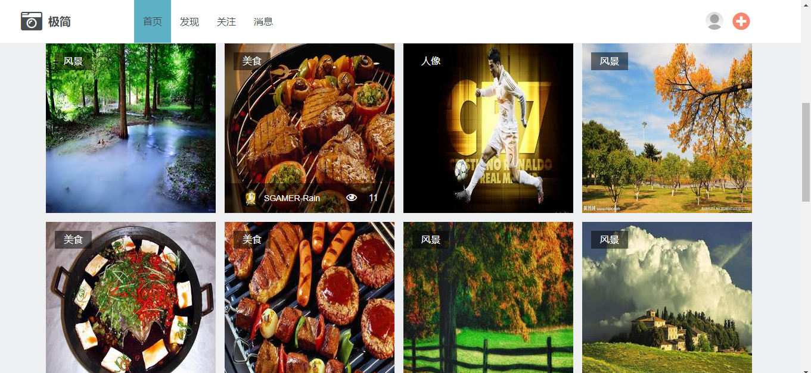
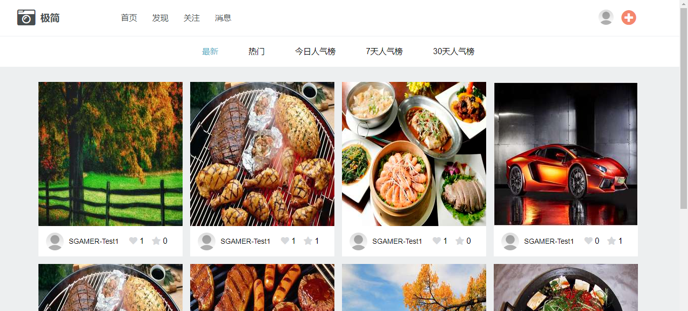
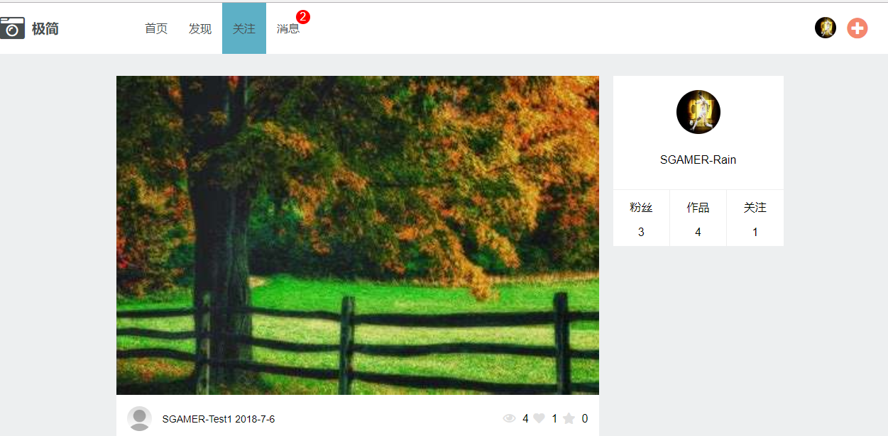
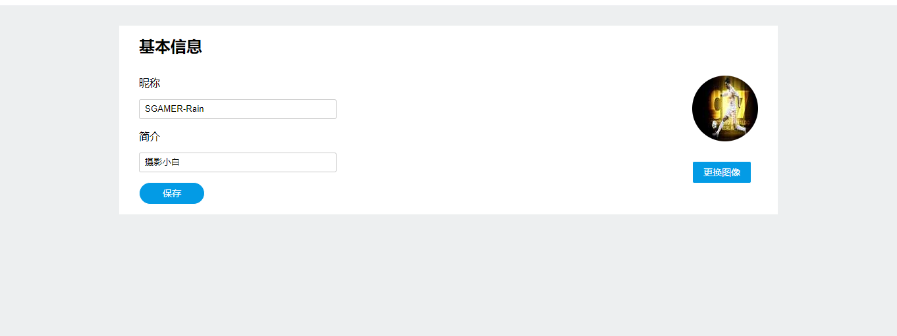
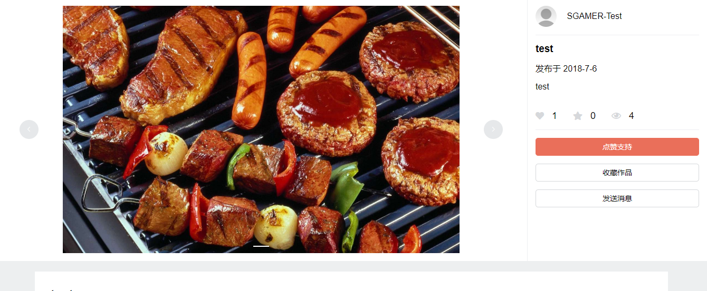

## 前言

用vue全家桶+koa自己搭建起来的一个图片分享社区。

## 功能

1. 登陆/注册
2. 首页推荐
3. 最热摄影师
4. 发现
5. 点赞/收藏
6. 评论
7. 图像上传(OSS存储)
8. 消息
9. 关注

## 技术栈

1. vue全家桶
2. css预处理器SCSS
3. koa+mysql搭建后台服务
4. 腾讯云OSS存储图片
5. axios请求后台服务

## 预览图

### 首页

### 发现

### 关注

### 消息

### 个人主页

### 个人设置

### 图片详情页

## 关于

[GitHub地址](https://github.com/SGAMERyu/vue-minimalist)

[线上地址](http://139.199.230.46:3000/#/)--建议在pc下浏览

## 总结和问题

1. 在项目的开始阶段一定要把需求和功能都定义好,不能临时起意再去添加功能,这样会导致整个项目的修改很麻烦。
2. 一些重复的样式分布在各个组件中,之后会用scss去定义一套样式模板。
3. 在兄弟组件传递数据用vuex会很方便

