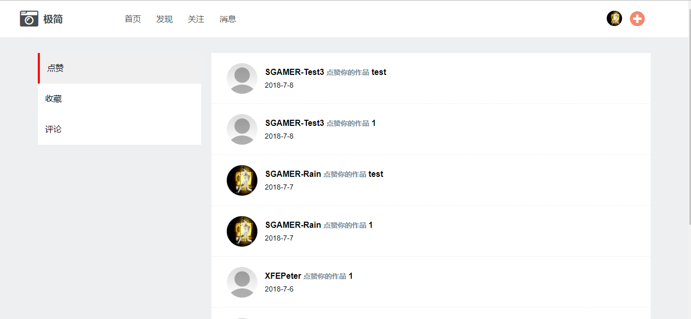

## 前言

用vue全家桶+koa自己搭建起来的一个图片分享社区。实现了发现,点赞,发图,评论,消息,个人中心等基本功能

## 源代码

[源代码]((https://github.com/SGAMERyu/vue-minimalist))

## 预览

[在线预览地址](http://139.199.230.46:3000/#/) 建议在PC下预览

## 技术栈

1. vue2.0 前端页面数据渲染
2. vuex 集中管理不同组件之间的公共状态
3. vue-router 前端路由管理
4. axios: http请求库
5. koa2 轻量级的node框架
6. 腾讯云OSS存储图片

## 总结

1. 用vuex去管理公共组件需要的状态很方便
2. 不要急于去开始写项目,要把所有要实现的功能去整理一遍再写,不能再项目的执行阶段在去构建一个新的功能,这样可能会破坏掉原有的功能
3. 用proxy去封装axios,会使之后的请求api编写非常容易

